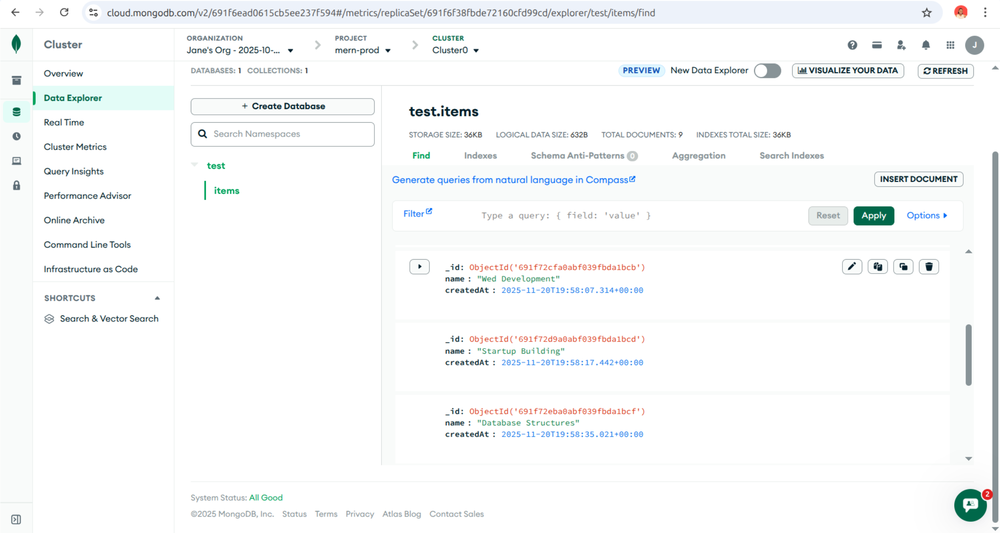

# MERN Production Starter

A minimal MERN stack ready for production deployment, CI/CD, and monitoring.

## Stack
- Frontend: React + Vite
- Backend: Express + MongoDB (Mongoose)
- CI: GitHub Actions
- Deployment: Vercel (frontend), Render (backend)
- Monitoring: Health endpoint, Sentry (optional)

## Setup

### Prerequisites
- Node.js 18+ (20 recommended)
- MongoDB Atlas cluster
- GitHub repo

### Local development
1. Copy env templates:
   - `cp backend/.env.example backend/.env`
   - `cp frontend/.env.example frontend/.env`
2. Fill values:
   - `backend/.env` → `MONGO_URI`, `CORS_ORIGIN=http://localhost:5173`
   - `frontend/.env` → `VITE_API_URL=http://localhost:8080`
3. Install deps:
   - `npm i --prefix backend`
   - `npm i --prefix frontend`
4. Run:
   - Backend: `npm run dev --prefix backend`
   - Frontend: `npm run dev --prefix frontend`

## Screenshot View

## Deploy

- Backend (Render): Connect repo → set env → `npm start` → auto-deploy on push.
- Frontend (Vercel): Import repo → set env → `npm run build` → auto-deploy on push.

## CI/CD
- `.github/workflows/ci.yml`: runs lint, tests, and build on PR/push.
- Auto-deploy via platform integrations (Render/Vercel) on successful push to `main`.

## Monitoring
- Sentry DSN optional via env.
- Uptime monitoring: point to `/health`.

## Maintenance
- Backups via Atlas
- Rollback: use Vercel/Render dashboards; revert to previous commit

## Developer
Built by Jane Mugo, a full-stack developer focused on building robust, user-friendly web applications for real-world use.
